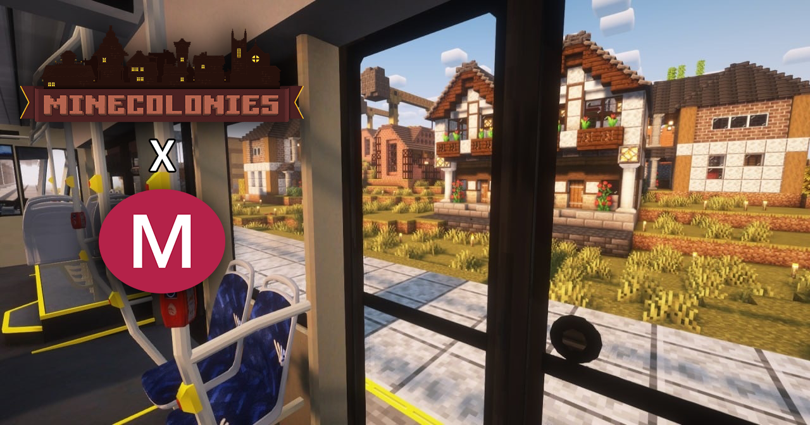

# MineColonies × MTR Integration
 
> **Статус: MVP / Early Development**
> Сабмод связывает систему навигации жителей [MineColonies](https://www.minecolonies.com/) с транспортной сетью [Minecraft Transit Railway (MTR)](https://www.curseforge.com/minecraft/mc-mods/minecraft-transit-railway), позволяя NPC использовать поезда для дальних перемещений.
 

 
---
 
## Совместимость
 
| Компонент | Версия |
|-----------|--------|
| Minecraft | `1.20.1` |
| Forge | `47.x` |
| MineColonies | `release/1.20` |
| MTR | `3.2.2-hotfix-1` (тег `3.x.x`, Forge `1.20–1.20.1`) |
 
---
 
## Что реализовано
 
- **Кастомный навигатор MineColonies** — регистрация собственного навигационного модуля для жителей колонии.
- **Перехват дальних целей** — если цель находится на расстоянии ≥ 96 блоков, жителю назначается маршрут через MTR вместо пешей прогулки.
- **Поиск маршрута** — запрос маршрута через `RailwayDataRouteFinderModule` из MTR.
- **Стейт-машина поездки** — полный цикл:
  1. Запрос маршрута
  2. Пешая прогулка к платформе посадки
  3. Поездка на поезде
  4. Высадка
  5. Пешая прогулка до конечной точки
- **Mixin в `TrainServer.simulateCar`** — серверная обработка NPC внутри вагонов.
- **Синхронизация NPC** — серверная посадка, движение и высадка, синхронизированные с позицией вагона поезда.
---
 
## Сборка проекта
 
### Требования
 
- JDK 17
- Gradle (используется wrapper — `./gradlew`)
- ForgeGradle `6.0.16+`
- SpongePowered Mixin `0.7+`
### Настройка зависимостей
 
`build.gradle` намеренно использует заглушки для MineColonies и MTR, так как точные deobf-координаты зависят от сборки/источника. Есть два варианта подключения:
 
**Вариант 1 — CurseForge Maven:**
```groovy
dependencies {
    compileOnly fg.deobf("curse.maven:minecolonies-<project_id>:<file_id>")
    compileOnly fg.deobf("curse.maven:mtr-<project_id>:<file_id>")
}
```
 
**Вариант 2 — Локальные jar-файлы (уже настроен в репозитории):**
 
Положите deobf-собранные jar'ы в `local-maven/local/mods/` и укажите:
```groovy
compileOnly fg.deobf("local.mods:minecolonies:1.20.1-1.1.859-snapshot")
compileOnly fg.deobf("local.mods:mtr:1.20-3.2.2-hotfix-1")
```
 
### Команды
 
Генерация запусков для IntelliJ IDEA:
```bash
./gradlew genIntellijRuns
```
 
Сборка мода:
```bash
./gradlew build
```
 
Готовый `.jar` будет в директории `build/libs/`.
 
---
 
## Структура проекта
 
```
MTR-with-Minecolonies-submob/
├── src/main/               # Исходный код мода (Java)
├── build/                  # Артефакты сборки
├── libs/                   # Дополнительные библиотеки
├── local-maven/            # Локальный Maven-репозиторий (deobf jar'ы зависимостей)
├── gradle/wrapper/         # Gradle wrapper
├── build.gradle            # Конфигурация сборки
├── gradle.properties       # Параметры мода и версии
└── settings.gradle         # Настройки проекта
```
 
---
 
## 🚧 Планы по доработке
 
- [ ] **Многосегментные маршруты** — сейчас приоритизируется только первый отрезок пути.
- [ ] **Умный выбор платформы** — более точный расчёт радиуса и выбор платформы посадки.
- [ ] **Распределение мест в вагоне** — уменьшение наложения NPC друг на друга.
- [ ] **Аварийные сценарии** — обработка случаев, когда маршрут становится невалидным в процессе поездки.
---
 
## 🤝 Вклад в проект
 
Pull Request'ы приветствуются. Перед отправкой убедитесь, что:
- Код компилируется без ошибок (`./gradlew build`)
- Изменения не ломают существующую стейт-машину поездки
- Новая функциональность сопровождается описанием в PR
---
 
## 📄 Лицензия
 
